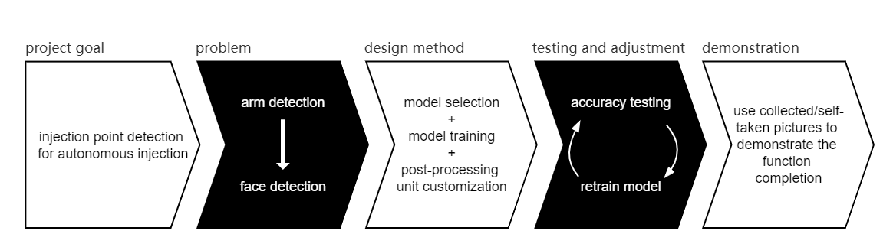

# J-Eye

## Introduction
The COVID-19 pandemic is still ongoing across the globe. It has impacted human life in many aspects and presented unprecedented challenges to public health, global transport systems, and many domains. Most of the governments have put into practice the lockdown policy and restricted international travel to mitigate the spread of the virus. While the fact is that there is no panacea with the power to fight against the virus yet, getting a vaccination is currently still one of the most effective means to alleviate the virus mortality and morbidity.

However, the global vaccination rate is still low especially in low-income countries for their limited access to medical resources and funding. According to WHO, only 14.5% of the population in low-income countries have received at least one dose. Many African nations have even lower vaccination rates, including Chad, Madagascar and Tanzania, whose immunization rates only range from 1.5% to 4% [1]. Delivering low-cost vaccination solutions is urgent yet challenging. Developing the vaccine itself is costly, yet another costly component is the vaccination itself, which imposes addition resources such as additional medical staff and extra medical costs. In addition, traditional vaccination may increase the risk of virus transmission and health care workers’ workload undoubtedly.

In summary, the current clinical demand clearly indicates urgent need for a safe and sufficient vaccine coverage in a time where the ongoing pandemic is still threatening and unseen measures have been imposed on society globally, including social distancing and lockdowns.

### Autonomous Injection Robot

Autonomous robotics injection came as a safe and effective solution for delivering vaccines in a human-less environment, where people just walked into and put their arm into an enclosed space. Recently, several such prototypes were developed they are listed briefly below.

**Cobi**: Waterloo has developed Cobi, the world’s first autonomous robotic needle-less injection. With LIDAR sensors and AI position tracking, Cobi is able to identify the human body. Then, as shown in the picture below, the 360-degree depth perception guides the needless robot arm to the injection site on the patient’s arm to deliver the drug. [2]

<p align="center">
     
Cobi, Waterloo's autonomous needle-less injection robot [2]
</p>

**Houyi**: As shown in the picture below, the automatic vaccine injection robot developed by Tongji University in Shanghai can also automatically identify the designated injection position on the human body, by means of 3D human body modeling. The recognition algorithm fits the 3D point picked up by cameras, with the corresponding parts on the 3D model, and then gives the injection spot. [3,4]

<p align="center">

<div align="center">
Houyi: Tongji University's automatic vaccine injection robot [3,4]
</div>
</p>

It is worth to mention that both solutions employ the needle-free vaccinations which ensure the safety and painless injection. Another key element of these robots is the ability of detecting the right injection site with intelligent ways. In both cases, complex 3D model recognition algorithm, equipped with multi-dimension sensors were utilized to fulfil the detection assignment. While these algorithms can provide accurate site detection, they also involve a lot of development efforts, costly sensing techniques and expensive cameras. These all contribute to the overall cost of these robots. In this project, we claim that coming up with a low-cost yet effective solution for autonomous injection site is important and can make a difference for deploying the robots to different parts of the world. Let's first understand where the injection site is usually located on the arm.

### Intramuscular Injection Site

The current COVID-19 vaccines are mainly given intramuscularly because muscles have good vascularity, which enables injection quickly involved in the systemic circulation. All things considered, the deltoid muscle (shown in the following figure) is the most suitable site for vaccination, because of its adequate blood supply and large area [5]. Based on the figure, we consulted the medical experts, and we conclude that the intramuscular injection site is a relative large body area and the differences exposed from individuals for this area are relatively small. This has inspired our idea of looking into an alternative solution for detecting the site with vision-AI assisted techniques.

<p align="center">
       
<div align="center">
Intramuscular Injection Site [5]
</div>
</p>

### Vision-AI Assisted Injection Site Detection

Existing researches for injection site detection above mainly utilize 3D sensing technology, which means an advanced AI model supporting 3D human body vision and correspondingly tailored camera are needed. Expensive hardware were also involved to facilitate these models.

In this project, we propose **J-Eye, a low-cost 2D vision-AI-assisted intramuscular injection site detection solution based on the Xilinx KV260 board**. The ultimate goal is to provide an alternative solution for facilitating the autonomous injection.

Here we aimed at building a low-cost injection site detection application on KV260 and making use of powerful tool suite provided by Xilinx. We also aim to explore the capability of 2D objection detection/location technology using a lightweight AI model which can be implemented on the FPGA board with easy setup.

Currently there are only few work focusing on 2D vision-AI assisted human arm detection and no large public dataset available for that. Considering the suitability of Vitis-AI model zoo to KV260 and its user-friendly training, quantization, compilation processes, we concentrate on fully deploying Vitis-AI’s models and its functionality. Also, based on the fact that human faces are more distinguishable than arms and the booming researches on face detection nowadays, we decided to leverage the value of face detection to locate the "featureless" deltoid muscle and the injection site with only 2D image processing. This was empowered by utilizing a face detect model available in the Vitis-AI model zoo and then transform its result to target the injection site.

## Project Overview

Our project is developed according to the logic flow shown below.

<p align="center">
       
The flow chart of this project
</p>

The goal is to let the monitor connected with KV260 indicate the injection site on patients’ arm. Due to the limitation on hardware resources and small number of existing arm detection work currently, we decided to simplify the problem into face detection assisted with post-processing to indicate results. For the main part of our project, we did research for model selection and training strategy based on Vitis-AI. And for post-processing, it is mainly OpenCV coding with VVAS usage. Then in testing stage, we used collected images that matched our application scenario to see the accuracy under different training epochs or training strategies, and then retrain the model accordingly. Lastly, the demonstration part is based on picture input for a more clear and stable results presentation.

## Environment Setup

### KV260

The following steps will let you know how to get started with KV260 and how to enable convenient file transmission between your computer and KV260.

Notice: The following setup and building processes are implemented on Windows.

Prerequisite: [Mobaxterm](https://mobaxterm.mobatek.net/), [balenaEtcher](https://www.balena.io/etcher/)

First, get the officially released [SD card image](https://www.xilinx.com/member/forms/download/xef.html?filename=petalinux-sdimage-2021.1-update1.wic.xz) and flash it to your SD card using balenaEtcher.


Then get your KV260 and computer connected like the following.


Open Mobaxterm, create a new session and select “Serial”,


Then select a serial port with the prefix “COM” described as USB type. Usually you will see two serial ports with matching characteristics, but the one with a smaller index is the correct one to be connected with.

Next, change the speed to 115200. And in Advanced Serial Settings part, modify the settings like the followings.


Click OK to connect to the board. Note that if you cannot see any message from the board and no error message is reported, please press Enter on your keyboard.

For easy file transmission between our computer and KV260, first we should enable ssh for our board.

In the terminal you just open in Mobaxterm for KV260, type in
```shell
ifconfig
```
to get the IP address of the board.

Then still in Mobaxterm, create a new session. Choose "SSH" and fill in the IP address you just had and specify the username as “petalinux”.


And in Advanced SSH Settings part, modify the ssh-browser type as “SCP (enhanced speed)”. Then click OK and you will see the terminal looks as follows.


Now, for file transmission, go to the directory you want to upload/download file to/from in Mobaxterm. Then just drag the file you want to transmit to/from the directory like the following image.


If there are error messages about permission during file transmission, you could try to modify the permission of the target directory by
```shell
sudo chmod 777 ${TARGET_DIRECTORY}
```

### Vitis-AI

The following steps will tell you how to set up Vitis-AI on your own computer.

Notice: The following setup and building processes are implemented on Ubuntu 20.04.  

Prerequisite: [docker](https://docs.docker.com/get-started/)

First, clone the Vitis-AI repo by this command.   
```shell
git clone --recurse-submodules https://github.com/Xilinx/Vitis-AI
```
Go to the cloned directory.
```shell
cd Vitis-AI
```
It is recommended to pull the docker image from docker hub by the following command, because it is quicker.
```shell
docker pull xilinx/vitis-ai:latest
```
Notice that the above command only builds CPU version Vitis-AI for you, for GPU version, you can use the shell document located under ``Vitis-AI/setup/docker/``    
```shell
./docker_build_gpu.sh
```
After the pull process finishes, you can launch Vitis-AI by
```shell
./docker_run.sh xilinx/vitis-ai
```


**VVAS (Vitis Video Analytics SDK)**    
The following steps will let you know how to setup VVAS cross-compilation environment if you want to modify/write VVAS related code for your customized applications. 

Notice: The following setup and building processes are implemented on Ubuntu 20.04.  

We will first setup the cross-compilation environment for VVAS provided by Xilinx. Go the directory of cloned Vitis-AI repo (if you do not have this, go the Vitis-AI setup part above). And then navigate to ``setup/mpsoc/VART`` and type in the following in command line.
```shell
./host_cross_compiler_setup.sh  
```
After the running command done, it will tell you how to start the setup cross-compilation environment like the following.
```shell
source ${PATH_TO}/environment-setup-cortexa72-cortexa53-xilinx-linux
```
Note that every time you start a new terminal, please re-run this command to start the environment.

Next, ``ls`` the current directory, you will see a sdk shell file. Then run the following command.
```shell 
./sdk.sh -d `pwd` -y
```
After this is done, you have setup the VVAS SDK, the command line will tell you activate it like,
```shell
. ${PATH_TO}/environment-setup-cortexa72-cortexa53-xilinx-linux
```
Note that every time you start a new terminal, please re-run this command to start the SDK.

Now you have prepared everything to compile a VVAS related code for your application. Detailed compilation process will be given in the Post-Processing Unit Building part.

In the following 3 sections, we will provide you detailed building flow explanation covering Vitis-AI model training for our application model, VVAS usage for our customized post-processing unit, and finally, how to integrate them with the original kv260-smartcam to build our application J-Eye. Their structural brief is shown below.


## Vitis-AI Model Preparation
<!-- Why densebox-->
The supported Vitis-AI models that can work with VVAS are limited. For model class FACEDETECT, which is what we need, only densebox is available for VVAS and with high accuracy. Considering our application scenario is vaccination. To reduce the risk of virus transmission, people mostly wear a mask while they got their shots. The pre-trained densebox in Vitis-AI uses a database WIDER FACE for general face detection training, where medically masked faces are not emphasized. To ensure that masked faces can be well detected, especially when people are turning their side face to the camera during injection, we trained densebox incrementally based on the pre-trained one using MAFA, one of the most popular datasets for masked face.

The detailed building process for preparing the AI model is shown below.

**Model Training**

Our model is trained using caffe, and its environment in Vitis-AI can be activated as
```shell
conda activate vitis-ai-caffe
```

The training process is based on a [pre-trained model](https://www.xilinx.com/bin/public/openDownload?filename=cf_densebox_wider_360_640_1.11G_2.0.zip) provided by Vitis-AI. Go to the directory of your downloaded official model by the above link. Then navigate to code/train/ and run the following command.

```shell
vai_q_caffe finetune -solver solver.prototxt -weights quantize_train_test.caffemodel -model train.prototxt
```
Note that all the files needed here is provided by Vitis-AI densebox model but we do some significant modification for our training process. You can access our modified files by https://github.com/iCAS-SJTU/J-eye/tree/main/models/train. But when you are repeating this step, please modify the path to the training dataset in ``train.prototxt``. And according to your computer configuration, you could change the batch size and max iteration in ``train.prototxt`` and ``solver.prototxt`` respectively. As for dataset, you can download it by this link https://drive.google.com/drive/folders/1nbtM1n0--iZ3VVbNGhocxbnBGhMau_OG

After this step done, you will derive a float model with suffix ``.caffemodel`` in directory ``${DOWNLOADED_MODEL_FILE_PATH}/code/train/snapshot``, which will be quantized in the next step

**Model Quantization**

Here we used the quantization command provided by Vitis-AI to generate quantized model needed for compilation.
```shell
vai_q_caffe quantize -model quantize.prototxt -weights armdetect_float.caffemodel -keep_fixed_neuron
```
You can find ``quantize.prototxt`` from downloaded densebox model and ``armdetect_float.caffemodel`` in https://github.com/iCAS-SJTU/J-eye/tree/main/models/float. And you should run this command in the directory you prepared all the needed files or you need to change the relative path in the command.

**Model Compilation**

Here we used the compilation command provided by Vitis-AI and you will derive a ``.xmodel`` file which can be placed on KV260.
```shell
vai_c_caffe -p quantized/deploy.prototxt -c quantized/deploy.caffemodel -a arch.json -o compiled/ -n arm_detect
```
You can find ``deploy.prototxt``, ``deploy.caffemodel``, and ``arch.json`` in https://github.com/iCAS-SJTU/J-eye/tree/main/models/quantized


## Post-Process Unit Building

Making use of VVAS will help us to transform the detection results to the monitor screen. Here we will show you how to compile our modified source code to library file that can be used by the post-processing configuration file. 

First we have to clone VVAS repo from github to obtain required utilities and libraries for our post-process code compilation. 
```shell
git clone https://github.com/Xilinx/VVAS.git
```

To obtain all the utilities and libraries we need, we must do the compilation in the following order
<ol>
<li> vvas-utils
<li> vvas-gst-plugins
<li> vvas-accel-sw-libs
</ol>

**vvas-utils**

First we should write your own ``meson.cross`` file based on the provided ``VVAS/vvas-utils/meson.cross.template``. There only two things you have to do modification, ``${SYSROOT}`` and ``${NATIVESYSROOT}``, where ``${SYSROOT}`` refers to ``${PATH_TO}petalinux_sdk_2021.1/sysroots/cortexa72-cortexa53-xilinx-linux`` and ``${NATIVESYSROOT}`` refers to ``${PATH_TO}/sysroots/x86_64-petalinux-linux``. 

If you are the first time to do this cross-compilation for VVAS, please do the following command.
```shell
cp meson.cross ${NATIVESYSROOT}/usr/share/meson/aarch64-xilinx-linux-meson.cross
```

Then we are ready for compilation:)

Source the environment for compilation using the command provided when you setup the cross compilation environment and SDK.
```shell
. ${PATH_TO}/environment-setup-cortexa72-cortexa53-xilinx-linux
source ${PATH_TO}/petalinux_sdk_2021.1/environment-setup-cortexa72-cortexa53-xilinx-linux
```

Suppose you are under directory ``VVAS/vvas-utils/``, 
```shell
mkdir build
meson build
cd build
ninja
```

After successful compilation for this part (Suppose you are still in directory ``build``), we have to type in the following commands to make our later compilation steps easier.
```shell
 cp pkgconfig/ivas-utils.pc ${SYSROOT}/usr/lib/pkgconfig
 cp utils/libivasutil.so utils/libxrtutil.so ${SYSROOT}/usr/lib
```
Also, copy all the header files under ``vvas-utils/`` directory into `` ${SYSROOT}/usr/include``

**vvas-gst-plugins**

Suppose you are under directory ``VVAS/vvas-gst-plugins/``, 
```shell
mkdir build
meson build
cd build
ninja
```
After successful compilation for this part (Suppose you are still in directory ``build``), do the following copy work to make our later compilation steps easier.
```shell
 cp pkgconfig/ivas-utils.pc ${SYSROOT}/usr/lib/pkgconfig
 cp ${SO_FILE_NAME}.so ${SYSROOT}/usr/lib
```
Also, copy all the header files under ``vvas-gst-utils/`` directory into `` ${SYSROOT}/usr/include``

**vvas-accel-sw-libs**

Suppose you are under directory ``VVAS/vvas-accel-sw-libs/``, go to ``vvas_xboundingbox/src`` and replace the ``vvas_xboundingbox.cpp`` by our [post-processing code](https://github.com/iCAS-SJTU/J-eye/tree/main/post-processing/src). Then
```shell
cd ../..
mkdir build
meson build
cd build
ninja
```

Now, under ``vvas_xboundingbox/`` you will find ``vvas_xboungdingbox.so`` which will be used as an important file for post-processing on KV260.


## Assembly on KV260

On KV260, download the package for application smartcam.
```shell
sudo dnf install packagegroup-kv260-smartcam.noarch
```

Under directory ``/opt/xilinx/share/ivas/smartcam/`` on KV260, 
```shell
mkdir armdetect
cd armdetect
```
and then copy all the configuration files in https://github.com/iCAS-SJTU/J-eye/tree/main/models/config to this directory. 

Next, go to directory ``/opt/xilinx/share/vitis_ai_library/models/kv260-smartcam``,
```shell
mkdir armdetect
cd armdetect
```
and then copy all the models related files in https://github.com/iCAS-SJTU/J-eye/tree/main/models/compiled to this directory.

For post-processing part, copy the library file from https://github.com/iCAS-SJTU/J-eye/tree/main/post-processing and put it under ``/opt/xilinx/lib``.


After all these done, you are ready to start our application by 
```shell
sudo xmutil unloadapp
sudo xmutil loadapp kv260-smartcam
sudo smartcam -u ${USB_PORT_NUMBER} -W 1920 -H 1080 --target dp -a armdetect
```
Note that the available ``${USB_PORT_NUMBER}`` can be found by ``ls /dev | grep media``.

## Results
To validate the detection capability of our trained model and post-processing unit, we selected photos of vaccinated people covering different genders, races, and ages from https://www.google.com/ and marked the output results in the corresponding photos. Here we only show part of our best performed results. You can see that the red rectangle indicates the face and the white filled circle shows the injection point. Compared with the injection point originally in the photo (the bandage), you can see that our detection results actually match well with the real ones.


## Demonstration

Notice: Due to the sudden outbreak of COVID-19 in Shanghai in March, we cannot enter the laboratory with our hardware devices there for a month. So there is no video demonstration here.

Below is how we did our demo after we start J-Eye on KV260. KV260 is connected with a camera and a monitor as it is shown below in the picture. The camera here will be equipped on the future robot arm for injection. And the monitor is also part of the robot body. People receiving injection should stand according to the marked position on the ground.  

<!--  -->
<p align="center">

Demonstration Setup 
</p>

Make sure that you stand up straight in front of the camera and your left side face is about in the screen center.

**What if you are not in the robot reachable range?**  
Our application supports presenting reminding message on the screen if the person receiving injection is standing at the corner of detectable range.


**How is the detection result shown in the screen?**  
If you stand in the detectable range, the application will locate your face and the injection point on the screen as it is shown below.


## Summary

The above results and demonstrations show that our proposed solution works well when the patient are in the detectable range and in a ready-to-be-injected posture like the photos above. There are surely limitation on its performance for detection under more complicated conditions when compared to 3D solutions, but this was really our first attempt. Our ongoing efforts include incorporating more complex models and working with researchers from Mechanical Engineering department to prototype the whole system. A conceptual diagram is shown below.

Here we briefly discuss the whole system working flow. The camera, embedded on the robotic arm, will be connected with the KV260 board. The detection result will be shown on the screen of the monitor. The robotic arm will receive the accurate detection information (e.g. coordinate) from the board and make the move accordingly. In the case where the patient is out of the scope of the camera, the warning information will be shown on the monitor until it gets back to the normal state. The detection will start once the human stands still and the face is in the camera view.

<p align="center">

A conceptual diagram of the J-Eye enabled autonomous vaccination robot
</a>

- **2D injection point detection with low cost and high adaptability:** The developing period of our project is relatively short and the cost is surely lower than the mentioned 3D sensing based injection point detection project. Meanwhile, J-eye has great potential for other body parts detection with post-pocessing and alternative models. As for the functionality, based on our presenting results and demonstration, the detection is acceptable and we will do further optimization surely.
- **Featureless body part detection technique exploration:** In our application scenario, arm detection is indispensable but human arm has too few features to be distinguishable enough in 2D images. So are many other human body parts that is pure skin but still important for medical treatment. We know that face detection is one of the well-developed vision-AI models nowadays and its accuracy has been proved satisfying for its wide usage in the market. What we have done is exploring its value in detecting other featureless human body parts assisted with post-processing transformation.
- **Working flow enhancement:** Our project fully benefits from Xilinx's hardware and software supports. But in VVAS setup and compiling part, some description is not so friendly for beginners. We tried to complete the above building process in details and intended to contribute to the official document. 

Even though here the demonstration only shows the potential injection point on the screen, it is also applicable to integrate it onto the next-gen injection robot. Below is our concept diagram. The camera will be fixed on the robot arm. It receives information about detected injection point location from KV260. And it will move towards the person if KV260 confirms safe and correct, otherwise it stays still and a warning message will be given on the screen. 

Lastly, we summarize our major contributions below for this project.

- **2D injection site detection with low cost and high adaptability:** The developing period of our project is relatively short and the cost is surely lower than the 3D sensing based injection site detection project. Meanwhile, J-eye has great potential for using other models. As for the functionality, based on our presenting results and demonstration, we show that the initial attempt is valid and effective. We are working on improving the detection accuracy by looking at more complex models and a potential usage of sampling the human body pictures from multiple cameras.    
  
- **Using Vitis-AI models to support featureless body area detection:** In our application scenario, arm detection is indispensable but human arm has too few features to be distinguishable enough in 2D images. So are many other human body parts that is pure skin but still important for medical treatment. We observed that face detection is one of the well-developed vision-AI models nowadays and its accuracy has been proved satisfying for its wide usage in the market. Our project transfers its value in detecting other featureless human body parts with adequate post-processing actions.
- **Enhancing the Xilinx flow:** Our project fully benefits from Xilinx’s hardware and software supports. But in VVAS setup and compiling part, some descriptions were outdated or made hard for beginners. During the development process, we also documented detailed instructions for the whole building process. It is fully open-sources and made available to the community.

## Acknowledgment

We would like to thank the Xilinx team for their generous help and their patience for answering all questions throughout this project, especially during the company merger and acquisition. We appreciate local health experts and medical staff for offering their professional advice.

## References
[1] https://www.cnbc.com/2022/02/02/these-countries-have-the-lowest-covid-vaccination-rates-in-the-world.html  
[2] https://www.inceptivemind.com/cobi-robot-autonomously-performs-intramuscular-injection-without-needles/21919/  
[3] https://www.globaltimes.cn/page/202201/1246148.shtml  
[4] https://inf.news/en/tech/1fe00617cfdae9eda4464a2b42006525.html  
[5] https://www.ncbi.nlm.nih.gov/pmc/articles/PMC7886662/  
[6] https://www.eet-china.com/mp/a86386.html  
[7] https://www.xilinx.com/support/documentation/sw_manuals/vitis_ai/1_3/ug1414-vitis-ai.pdf  
[8] https://xilinx.github.io/kria-apps-docs/main/build/html/docs/smartcamera/docs/app_deployment.html  
[9] https://github.com/Xilinx/VVAS  